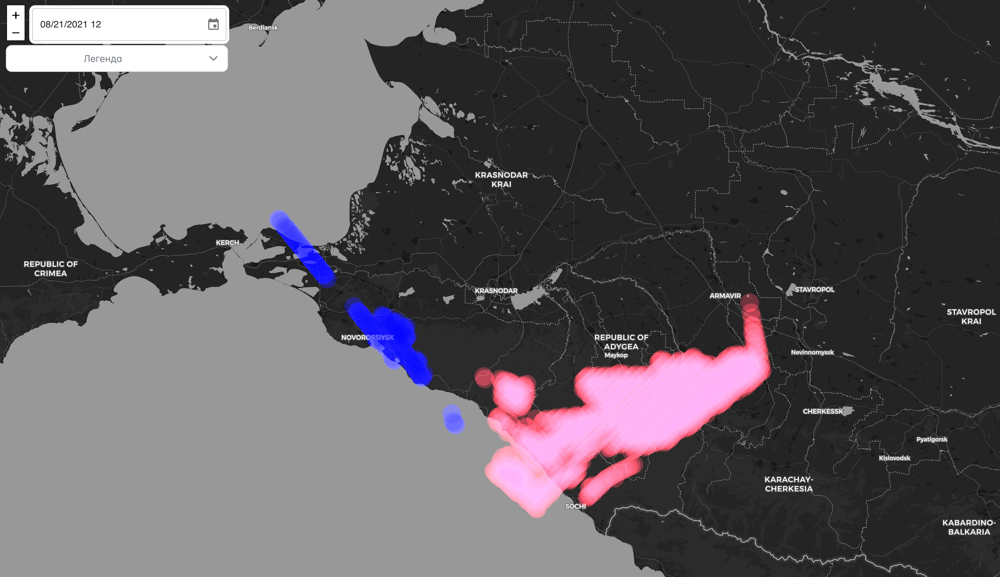
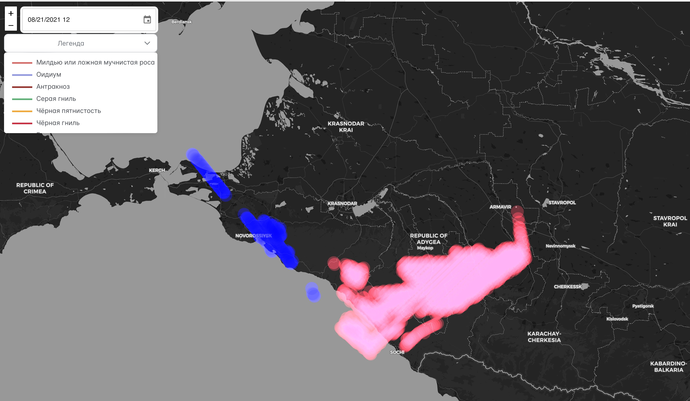

# Vineyards disease analysis and prediction system
## Technology stack:
1. Python analytical libs: `numpy`, `sci-py`.
2. Golang transitional web-server.
3. React Native frontend representation.
## Installation:
1. Move to `api-server/config/local.yaml`.
2. Set your `python` alias (e.g. `python3` for Linux and `python` for Windows).
3. Set absolute path to `get_prediction.py` in your local local machine.
4. Set absolute path to `storage` location in your local machine.
5. Unzip `ag_code/day_logs_raw.zip`.
6. Install `requirements.txt` using `pip -r requirements.txt` or `pip3 -r requirements.txt`.
7. Move to `api-server`.
8. Run api-server using `go run cmd/agroAPI/main.go -config="config/local.yaml"`.
9. Open `front` and run `npm install`.
10. Run `npm start`.
### Images:

